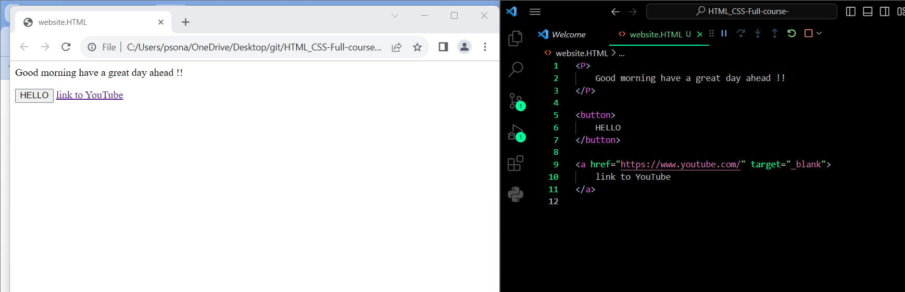
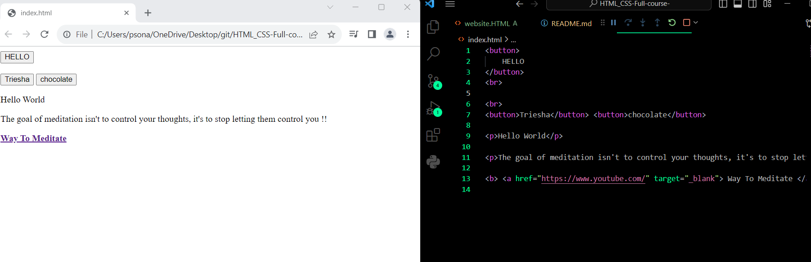
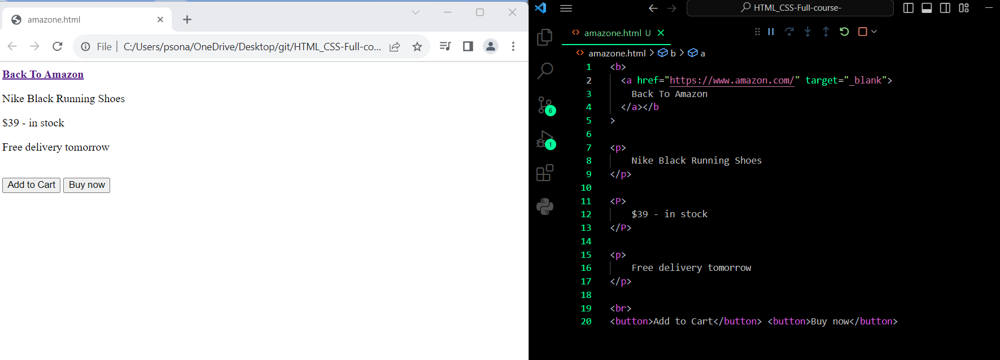
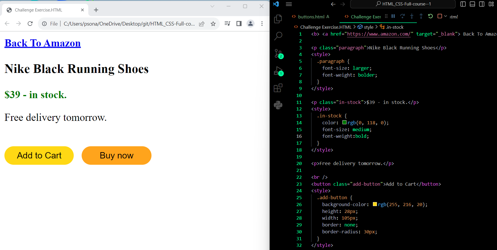
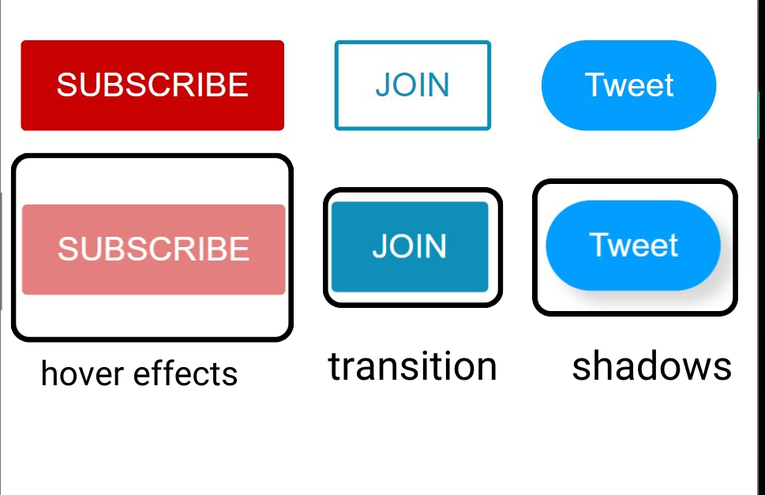

# ✮ HTML-CSS (Full course) ✮
 
<b> <a href="https://youtu.be/G3e-cpL7ofc?si=Yb9xtvVlzGWIZteJ" target="_blank"> Link to tutorial </a></b>
 
Date:-31/11/2023
 
Enlisted below things I learnt today. 👇
 
✮[1] How to write html code and then turn it into website.
 
✮[2] How to write HTML Attributes which modify the behaviour of an element.
 
✮[3] Also learnt about Syntax which rules we have to follow while writing our code.
 

 

Date:- 01/11/2023
 
✮[1] Made projects mentioned in the tutorial

 
✮[2] Challenge Exercise mentioned in the tutorial
 

 

Date:- 02/11/2023
 
Enlisted below things I learnt today. 👇
 
✮CSS Basics
 
✮[1] Created element with HTML
  ✮[2] Style with CSS one-by-one

 
✮[3] Challenge exercise mentioned in the tutorial

 

Date:- 03/11/2023
 
Enlisted below things I learnt today. 👇
 
About intermediate HTML skills
 
✮[1] Creating hover effects
  ✮[2] Transitions
  ✮[3] Shadows 
 

