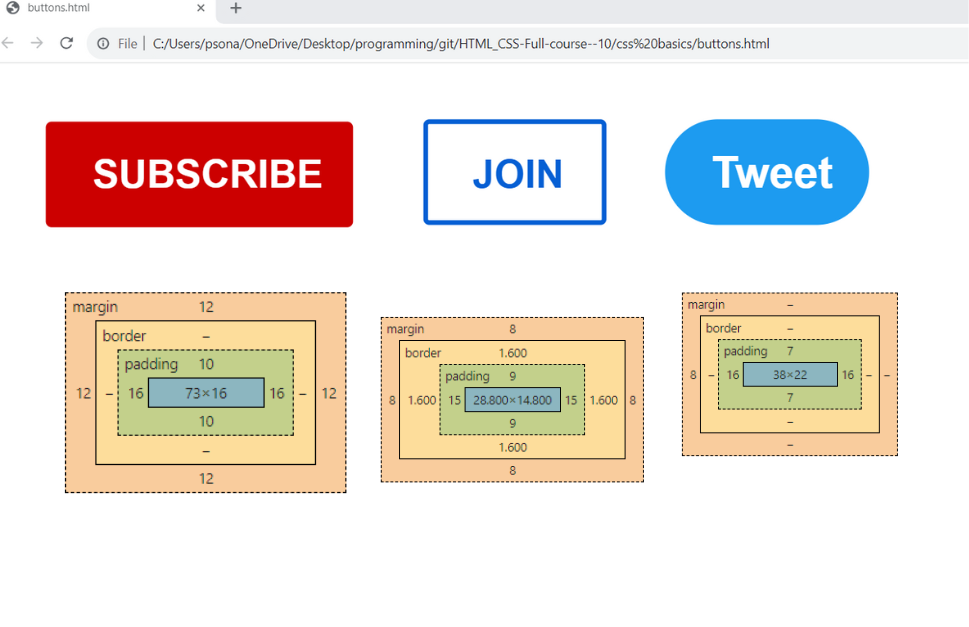
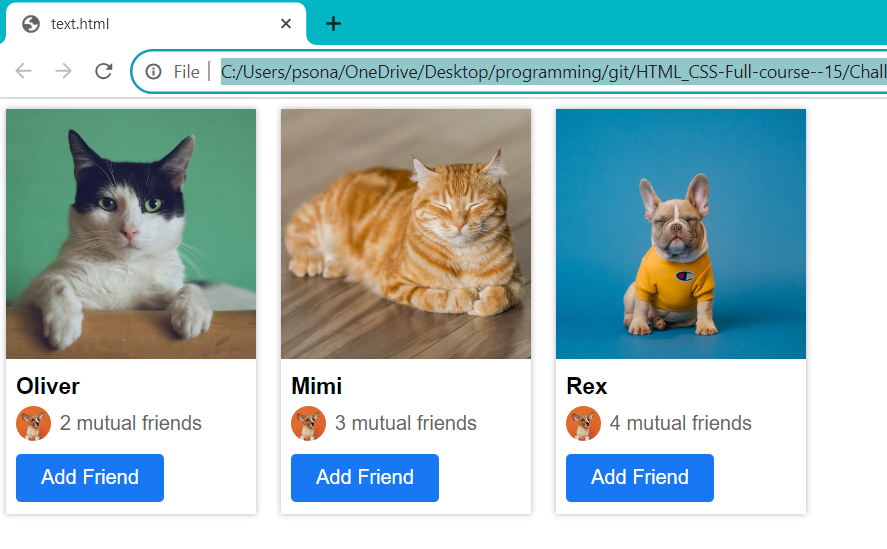
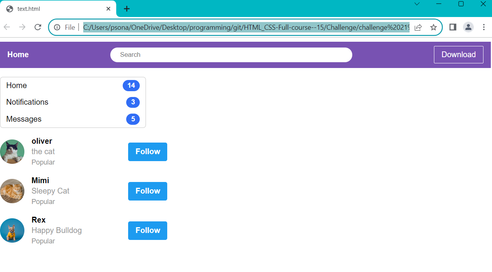

# ✮ HTML-CSS (Full course) ✮
 
<b> <a href="https://youtu.be/G3e-cpL7ofc?si=Yb9xtvVlzGWIZteJ" target="_blank"> Link to tutorial </a></b>
 
Date:-31/10/2023
 
Enlisted below things I learnt today. 👇
 
✮[1] How to write html code and then turn it into website.
 
✮[2] How to write HTML Attributes which modify the behaviour of an element.
 
✮[3] Also learnt about Syntax which rules we have to follow while writing our code.
 

 

Date:- 01/11/2023
 
✮[1] Made projects mentioned in the tutorial

 
✮[2] Challenge Exercise mentioned in the tutorial
 

 

Date:- 02/11/2023
 
Enlisted below things I learnt today. 👇
 
✮CSS Basics
 
✮[1] Created element with HTML
  ✮[2] Style with CSS one-by-one

 
✮[3] Challenge exercise mentioned in the tutorial

 

Date:- 03/11/2023
 
Enlisted below things I learnt today. 👇
 
About intermediate HTML skills
 
✮[1] Creating hover effects
  ✮[2] Transitions
  ✮[3] Shadows 
 

 

✮Challenge Exercise
 

 

Date:- 06/11/2023
 
Enlisted below things I learnt today. 👇
 

✮ Learnt About Chrome Development Tools
 
✮CSS Box Model
 

 

Date:- 07/11/2023
 
Enlisted below things I learnt today. 👇
 

✮ Text Style
 

 

 

Date:- 08/11/2023
 

Enlisted below things I learnt today. 👇
 

✮ Challenge exercises mentioned in the video
  

[1] With the help padding 
 

https://github.com/trieshasonarkar1224/HTML_CSS-Full-course-/assets/147965443/844a88eb-ea8b-4ef8-ba9d-4e45f9a3092c

 

[2] Text style
<b>

 

Date:- 09/11/2023
 

Enlisted below things I learnt today. 👇
 

✮ The HTML Structure
 

[1] Learnt how to move css insto a separate file,using <link> element
 
[2] Challenge exercise mentioned in the tutorial
 

 

Date:- 10/11/2023
 

Enlisted below things I learnt today. 👇
 

✮ Images and text boxes
 

 

[1] Challenge exercise mentioned in the tutorial
 

 

Date:- 14/11/2023
 

Enlisted below things I learnt today. 👇
 

✮ [1] css display property

✮ [2] challenge excercise mentioned in the video 

Date:- 15/11/2023
 

Enlisted below things I learnt today. 👇
 

[1] learnt about < div > element

[2] challenge excercise mentioned in the video

Date:- 16/11/2023
 

Enlisted below things I learnt today. 👇
 

[1] nested layouts techniques

Date:- 17/11/2023
 

Enlisted below things I learnt today. 👇
 

[1] challenge excercise mentioned in the video

 

Date:- 20/11/2023
 

Enlisted below things I learnt today. 👇
 

[1] Css grid
 

 

 

[2] challenge excercise
 

 

[3] FlexBox
 

 

[4] Challenge excercise
 

Date:- 21/11/2023
 

Enlisted below things I learnt today. 👇
 

[1] nested flexbox
 

[2] practice excercises
 

 

Date:- 22/11/2023
 

Enlisted below things I learnt today. 👇
 

[1] css position (absolute and relative)
 

[2] practice excercises

 

Date:- 23/11/2023
 

Enlisted below things I learnt today. 👇
 

[1] completed with html & css crash course (created the clone of youtube)
 

